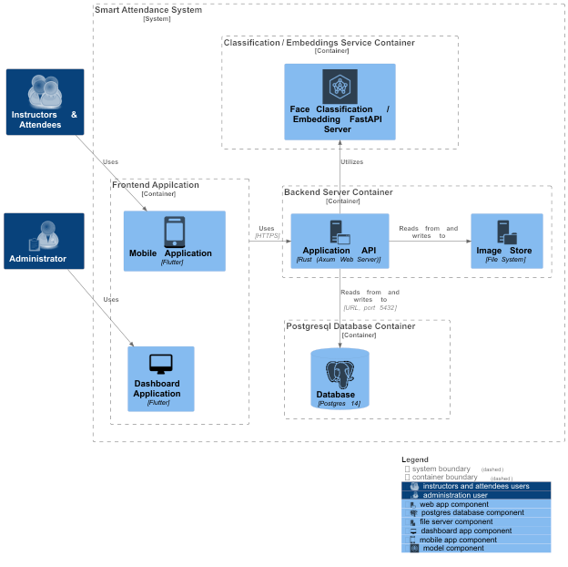
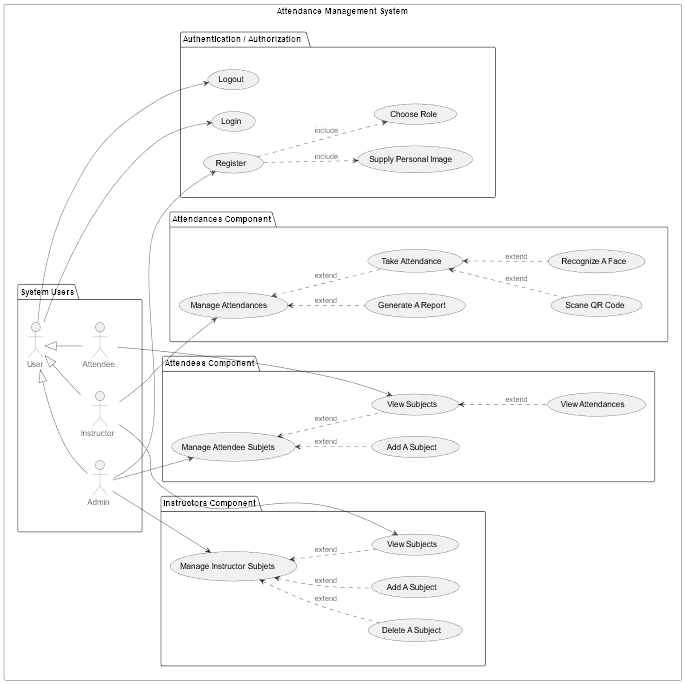
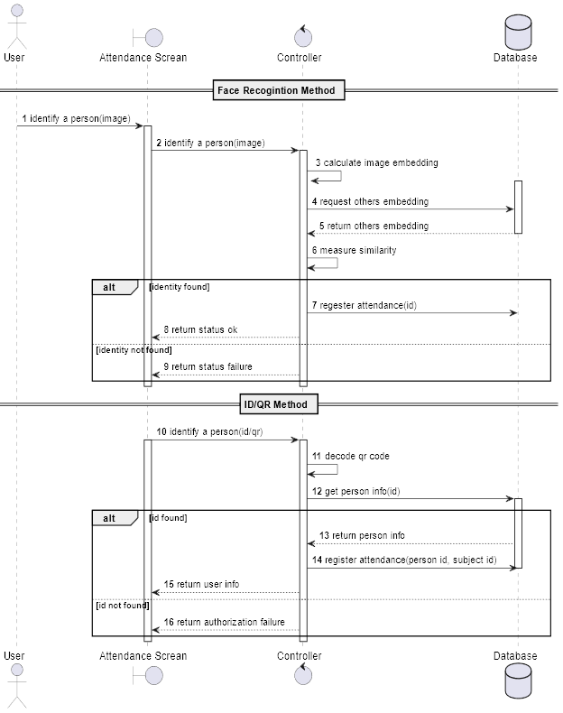
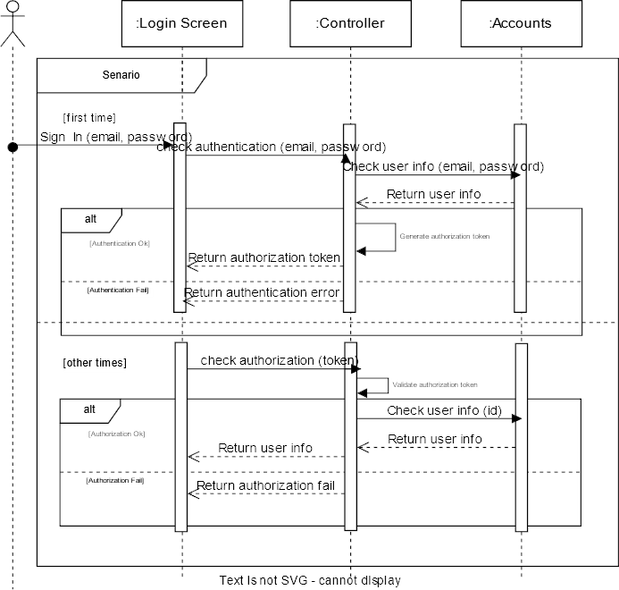
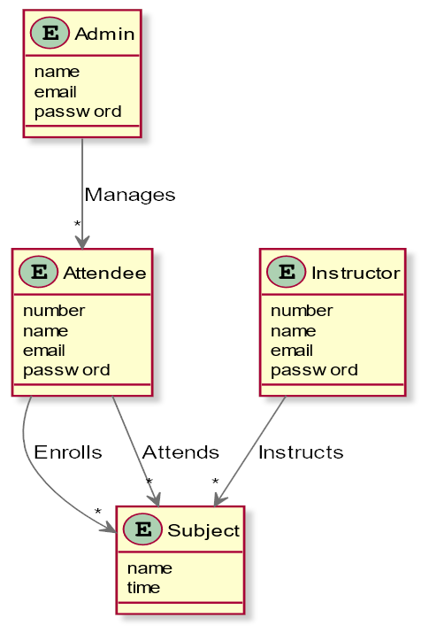
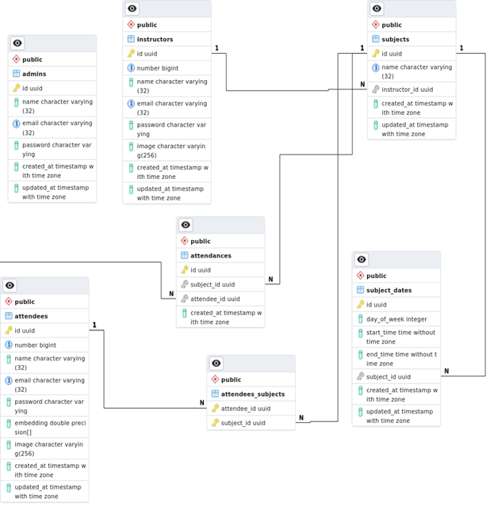
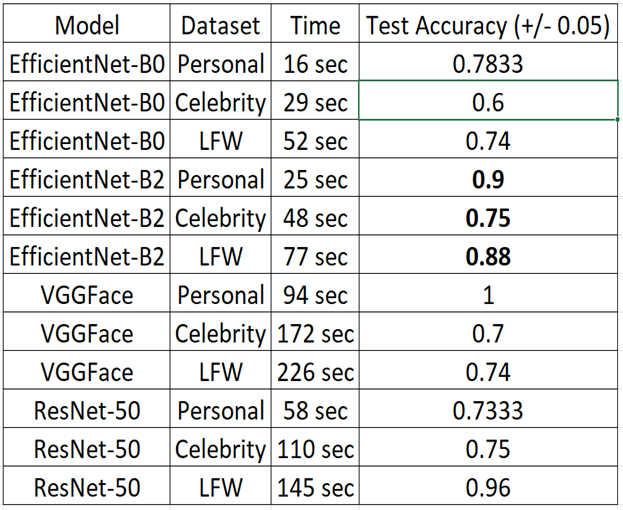
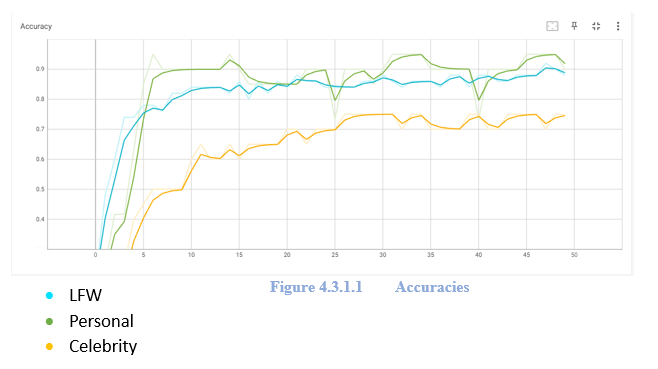
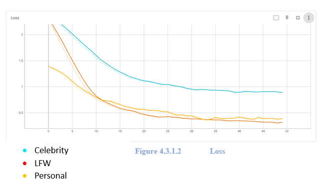
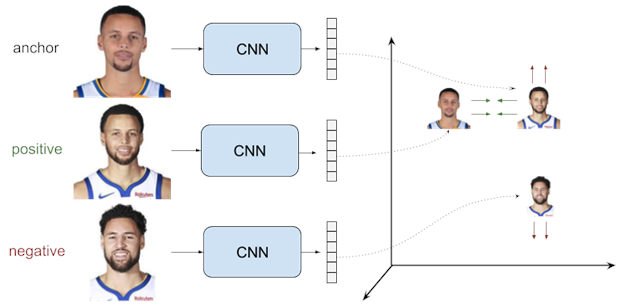

  
  <h1>Attendo</h1>
  
Attendance System based on Face Recognition for graduation project (2023)

  

## Features ✨
- 📷 Take Attendance with Face Recognition
- 🔢 Take Attendance with QR Code and ID
- 📊 Generate Reports
- 🔄 Automating Attendance Tracking Process
- 📋 Admin Dashboard
- 📘 API Docs
- 📱 Mobile Application
- 🌐 Cross-platform

  

## Background 📚
### Smart Attendance System with Face Recognition and QR Codes <a href="#ref-1"> [1] </a>
A research study by Singh et al. (2018) proposed a smart attendance system that integrated face recognition and QR codes for tracking attendance in a university setting. The system achieved high accuracy and significantly reduced the time required for attendance-taking compared to traditional manual methods.

### Effectiveness of RFID-Based Smart Attendance System <a href="#ref-2"> [2] </a>
Sahu and Bhatt (2018) examined the effectiveness of an RFID-based smart attendance system in a manufacturing company. The study found that the system led to a remarkable reduction in absenteeism and improved attendance tracking accuracy and efficiency.

### Impact of Smart Attendance System on Student Attendance and Academic Performance <a href="#ref-3"> [3] </a>
A study by Khan and Ahmed (2019) investigated the impact of a smart attendance system on student attendance and academic performance. The findings revealed that the system positively influenced attendance rates, particularly among previously absent or tardy students. Moreover, it correlated with improved academic performance, with students attending more classes achieving higher grades.

### Smart Attendance System with Face Recognition and Deep Learning <a href="#ref-4"> [4] </a>
Han et al. (2019) developed a smart attendance system using face recognition and deep learning techniques. The system exhibited superior accuracy even with large datasets and challenging lighting conditions, making it a robust solution for attendance tracking.

### Biometric-Based Smart Attendance System in Educational Institutions <a href="#ref-5"> [5] </a>
Alshehri and Drews (2020) conducted a study comparing a biometric-based smart attendance system with traditional attendance tracking methods in educational institutions. The results demonstrated that the smart system outperformed conventional methods, offering better accuracy, efficiency, and user satisfaction among students and teachers.

### Enhancing Attendance Accuracy and Efficiency in Primary Schools <a href="#ref-6"> [6] </a>
Tsoi et al. (2019) explored the use of a smart attendance system in a primary school setting. The study revealed that the system improved attendance accuracy and reduced the time required for attendance-taking, making it beneficial for educational institutions.

  

## Architecture 🏛️

**The smart attendance system consists of various modules, each playing a crucial role in its operation. Here are the key modules and their functions:**

| Module               | Description                                                                                                                                                   |
|----------------------|---------------------------------------------------------------------------------------------------------------------------------------------------------------|
| Face Recognition Module | A container for facial recognition that serves a Face Embedding Model and a Face Classification Model. The Face Embedding Model transforms facial images into high-dimensional numerical representations (embeddings), enabling efficient face recognition and similarity comparisons. The Face Classification Model discriminates between different individuals and accurately recognizes known faces. |
| Web Server Module    | A container that hosts the backend server, handling incoming requests from clients (such as web browsers) and serving responses over the internet. It manages communication protocols and processes requests.                         |
| Application API Module | A software component that handles incoming requests from clients and serves responses over the internet. It manages communication protocols and processes requests.                                        |
| Image Store Module   | A file system module for managing and serving the system's images, facilitating efficient image storage and retrieval.                                       |
| PostgreSQL Database Module<a href="#ref-8"> [8] </a> | A container Database Management System that stores information about the system resources (e.g., attendees, instructors, subjects) in records in a table format.                   |
| Front End Application | Software used by system users (attendees, instructors, and admins) to interact with the system through an easy-to-use interface, facilitating seamless user experience.            |
| Mobile Application   | A mobile application built using Flutter <a href="#ref-7"> [7] </a> that enables taking attendance using face recognition and QR code technologies. It utilizes the device's camera to capture and analyze facial features or scan QR codes for identification purposes.        |
| Dashboard Application | A GUI that serves as an administrative tool for managing the system resources. It provides functionalities for adding new users, updating existing data, deleting records, and performing other administrative tasks through a user-friendly interface.  |

  

## Diagrams 📊

### Usecase Diagram

### Sequence Diagram 1

### Sequence Diagram 2

### Class Diagram

### Database Schema

  

## DataSets 📊
- **LFW Dataset<a href="#ref-15"> [15] </a>**
  - Description: Labeled Faces in the Wild (LFW) is a popular benchmark dataset in face recognition research.
  - Statistics: Contains around 13,000 images of 5,749 unique individuals.

- **Microsoft Artificial Dataset <a href="#ref-16"> [16] </a>**
  - Description: The Microsoft Artificial Dataset comprises a significant number of artificially generated face images.
  - Statistics: The DigiFace1M subset of the dataset contains 1 million synthetic face images.

- **Personal Dataset**
  - Description: The Personal Dataset includes images of 7 individuals captured specifically for this project.
  - Statistics: 10 images per person, totaling 70 images.

- **Celebrity Dataset**
  - Description: The Celebrity Dataset consists of images of 10 well-known celebrities from various sources.
  - Statistics: 10 images per celebrity, totaling 100 images.

  

## Development 🚀

###  Classification Model 🏆
In our experiment, we explored the performance of four different classification models: EfficientNetB0 <a href="#ref-10"> [10] </a>, EfficientNetB2, VGGFace <a href="#ref-13"> [13] </a>, and ResNet50 <a href="#ref-14"> [14] </a>. We evaluated these models on three distinct datasets: LFW , Celebrity, and Personal. Each dataset provided a unique set of challenges and variations in facial images.

🔍 We systematically combined each model with every dataset to observe the resulting accuracy and loss. By examining the combination of models with different datasets, we aimed to understand the strengths and weaknesses of each model in different contexts.

**In the following table, we trained the models for 50 epochs and observed:**

📈 Based on our comprehensive evaluation of the four classification models—EfficientNetB0, EfficientNetB2, VGGFace, and ResNet50—in combination with the LFW, Celebrity, and Personal datasets, we have determined that EfficientNetB2 is the most suitable model for our intended application. Through rigorous analysis, we found that EfficientNetB2 consistently achieved high accuracy and demonstrated remarkable performance across multiple datasets.

💪 EfficientNetB2 exhibited superior results on both the Celebrity and Personal datasets, indicating its ability to capture intricate facial features and adapt well to various image variations. Its impressive performance, combined with its efficiency in terms of computational resources, makes EfficientNetB2 an ideal choice for our facial recognition task.

✅ Considering the importance of accuracy, generalization capabilities, and computational efficiency, we have made an informed decision to employ EfficientNetB2 as our primary classification model for the proposed application. This selection ensures a reliable and efficient facial recognition system that can effectively handle diverse real-world scenarios.

**Test Accuracy for EfficientNet-B2 on the three datasets:**

**Test Loss for EfficientNet-B2 on the three datasets:**

###  Embedding 🧠
🎭 As another powerful technique, we delved into face embedding—a process that transforms a face image into a high-dimensional feature representation. This representation, known as an embedding, captures the unique characteristics of a face and facilitates measuring similarities or distances between faces.

🔍 In our experiments, we harnessed the potential of a Siamese network architecture combined with the triplet loss function. The Siamese network comprises three identical subnetworks, sharing the same weights. Taking three face images as input, it produces their corresponding embeddings. The triplet loss function then trains the network by minimizing the distance between an anchor face embedding and a positive (same identity) face embedding, while maximizing the distance between the anchor face embedding and a negative (different identity) face embedding.

**Triplet Loss Formula:**
loss = max(0, ||A-P||^2 - ||A-N||^2 + α)

where:
- A: Anchor embedding vector
- P: Positive embedding vector
- N: Negative embedding vector
- α: Margin that determines the minimum separation between positive and negative pairs

😕 The naive approach in face recognition involves randomly selecting triplets for training the embedding model without considering the difficulty of the samples. In this case, the model learns from triplets that may not provide sufficient discriminative information, leading to suboptimal performance.

🚀 To overcome this challenge, we embraced the online triplet approach, dynamically selecting hard triplets during training. A hard triplet consists of an anchor, a positive (same identity) sample, and a negative (different identity) sample that are challenging to distinguish. By focusing on hard triplets, the model is pushed to learn more robust and discriminative embeddings.

🏆 As our experiments progressed, we encountered difficulties in achieving optimal performance solely with our custom-built network architecture. To overcome this, we decided to harness the power of transfer learning and adopted the FaceNet<a href="#ref-18"> [18] </a> pretrained model. FaceNet is a widely recognized face recognition model trained on a large-scale dataset, demonstrating outstanding performance in embedding faces into a high-dimensional space. By leveraging the FaceNet model, we achieved higher accuracy and benefited from its robust features.

  

## Screenshots 📸

<h3 align="center"> API Docs</h3>

<h3 align="center"> Dashboard</h3>
<table>
  <tbody>
    <tr>
      <td align="center"></td>
      <td align="center"></td>
      <td align="center"></td>
    </tr>
    <tr>
      <td align="center"></td>
      <td align="center"></td>
    </tr>
  </tbody>
</table>

<h3 align="center">  Mobile Application</h3>
<table>
  <tbody>
    <tr>
      <td align="center"></td>
      <td align="center"></td>
      <td align="center"></td>
      <td align="center"></td>
    </tr>
    <tr>
      <td align="center"></td>
      <td align="center"></td>
      <td align="center"></td>
      <td align="center"></td>
    </tr>
    <tr>
      <td align="center"></td>
      <td align="center"></td>
      <td align="center"></td>
      <td align="center"></td>
    </tr>
  </tbody>
</table>

  

## Demo 🚀

https://github.com/Mina329/attendo/assets/96777964/afce634c-e0da-4c6e-a15a-e4211aee79d6

  

<h2 align="center">Meet the Brilliant Minds Behind the Project 🌟</h2> 

  <table align = "center">
    <tr>
      <td align="center"><a href="https://github.com/mina329"> <b>Mina Emil</b></a> </td>
      <td align="center"><a href="https://github.com/minasaad47"> <b>Mina Saad</b></a> </td>
    </tr>
  </table>

  

## References 📚
##### [1] <a name="ref-1" href=""> Singh, A., Verma, M., Jain, A., & Khan, A. (2018). Smart Attendance System Using Face Recognition. In 2018 4th International Conference on Computing Sciences (pp. 6-10). IEEE.</a>
##### [2] <a name="ref-2" href="" >Sahu, R. P., & Bhatt, V. (2018). Effectiveness of RFID-Based Smart Attendance System in a Manufacturing Company. In 2018 International Conference on Inventive Research in Computing Applications (pp. 582-586). IEEE.</a>
##### [3] <a name="ref-3" href="">Khan, M. S., & Ahmed, M. U. (2019). Impact of Smart Attendance System on Student Attendance and Academic Performance. In Proceedings of the 2nd International Conference on Intelligent Technologies and Applications (ICITA 2019) (pp. 27-31).</a>
##### [4] <a name="ref-4" href="">Han, H., Otto, C., Jain, A., & Bhanu, B. (2019). Age invariant face recognition: A survey. Pattern Recognition, 81, 15-39.</a>
##### [5] <a name="ref-5" href="">Alshehri, M., & Drews, P. (2020). Biometric-based Smart Attendance System in Educational Institutions. Journal of Physics: Conference Series, 1475(4), 042045.</a>
##### [6] <a name="ref-6" href="">Tsoi, Y. K., Siu, W. C., Zhang, Y., Zhang, X., Chen, S., & Wong, K. C. (2019). Enhancing Attendance Accuracy and Efficiency in Primary Schools Using a Smart Attendance System. In Proceedings of the 2019 7th International Conference on Information Technology: IoT and Smart City (ICIT 2019) (pp. 72-76).</a>
##### [7] <a name="ref-7" href="https://flutter.dev/">Flutter. </a>
##### [8] <a name="ref-8" href="https://www.postgresql.org/">PostgreSQL.</a> 
##### [9] <a name="ref-9" href="https://www.docker.com/">Docker. </a>
##### [10] <a name="ref-10" href="https://proceedings.mlr.press/v97/tan19a.html">Tan, M., & Le, Q. V. (2019). EfficientNet: Rethinking Model Scaling for Convolutional Neural Networks. Proceedings of the 36th International Conference on Machine Learning (ICML), 97, 6105-6114 .  </a>
##### [11] <a name="ref-11" href=" https://doc.rust-lang.org/">Rust.  </a>
##### [12] <a name="ref-12" href="https://github.com/tokio-rs/axum">Axum Framework.  </a>
##### [13] <a name="ref-13" href="http://www.robots.ox.ac.uk/~vgg/publications/2015/Parkhi15/parkhi15.pdf">VGGFace: Parkhi, O. M., Vedaldi, A., & Zisserman, A. (2015). Deep Face Recognition. Proceedings of the British Machine Vision Conference (BMVC), 1-12  </a>
##### [14] <a name="ref-14" href="https://openaccess.thecvf.com/content_cvpr_2016/html/He_Deep_Residual_Learning_CVPR_2016_paper.html">RESNET-50: He, K., Zhang, X., Ren, S., & Sun, J. (2016). Deep Residual Learning for Image Recognition. Proceedings of the IEEE Conference on Computer Vision and Pattern Recognition (CVPR), 770-778.  </a>
##### [15] <a name="ref-15" href="http://vis-www.cs.umass.edu/lfw/">Huang, G. B., Ramesh, M., Berg, T., & Learned-Miller, E. (2007). Labeled Faces in the Wild: A Database for Studying Face Recognition in Unconstrained Environments. University of Massachusetts, Amherst, Technical Report 07-49  </a>
##### [16] <a name="ref-16" href="https://github.com/microsoft/DigiFace1M">Microsoft Research. Microsoft Artificial Intelligence: Microsoft AI's artificial faces.   </a>
##### [17] <a name="ref-17" href="https://pytorch.org/">PyTorch. (2021). PyTorch: An open-source machine learning framework.  </a>
##### [18] <a name="ref-18" href="https://arxiv.org/abs/1503.03832 ">Schroff, F., Kalenichenko, D., & Philbin, J. (2015). FaceNet: A Unified Embedding for Face Recognition and Clustering. Proceedings of the IEEE Conference on Computer Vision and Pattern Recognition (CVPR), 815-823.   </a>

  

## Acknowledgments 🙏
- We would like to express our sincere gratitude to our supervisor and faculty members who provided valuable guidance and support throughout the project.
- Special thanks to our families and friends for their unwavering encouragement and belief in us.
- We are also grateful to the open-source community for providing valuable tools and resources that greatly contributed to the success of this project.

  

